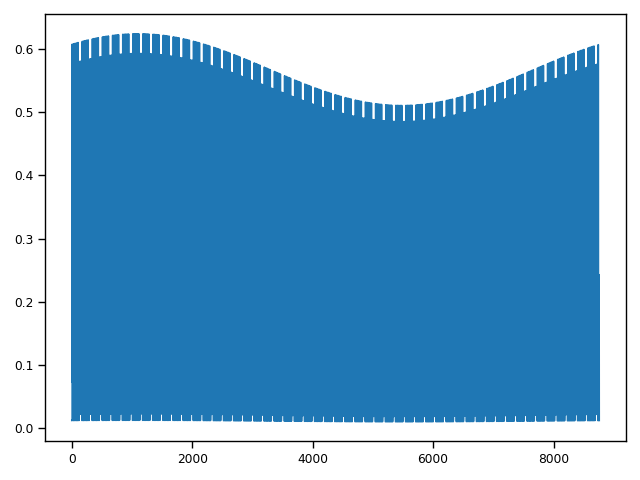

# OpenDHW Documentation

OpenDHW tries to mimic the behaviour of the popular Open Source Programme DHWcalc from Uni Kassel ([Link Paper](http://www.solar.uni-kassel.de/sat_publikationen_pdf/2005%20ISES-SWC%20Jordan%20und%20Vajen%20Program%20to%20Generate%20Domestic%20Hot%20Water%20Profiles%20with%20Statistical%20Means%20for%20User%20Defined%20Conditions.pdf), [Link Manual](https://www.uni-kassel.de/maschinenbau/fileadmin/datas/fb15/ITE/icons/Bilder_re2/Bilder_OpenSorp/dhw-calc_1-10_manual.pdf)), but implemented as a python script, rather than a standalone software.

## Core Structure

OpenDHW is mainly build on the Pandas Dataframe structure with the addition of using a DatetimeIndex ([Pandas Documentation Timeseries](https://pandas.pydata.org/pandas-docs/stable/user_guide/timeseries.html)). This ensure fast maipulation and easy plotting of the resulting timeseries. Thus, the base structre is always initialized by a dataframe and the chosen timestep width in seconds (s_step):

```Python
s_step = 60
date_range = pd.date_range(start='2019-01-01', end='2020-01-01', freq=str(s_step) + 'S')
date_range = date_range[:-1]
timeseries_df = pd.DataFrame(index=date_range, data={some data})
```

## Generating Timeseries

The two main functions are the "generate_dhw_profile" function, which generates a DHW timeseries with the OpenDHW algorythm, and the "import_from_dhwcalc" function, which loads a timeseries previously generated by DHWcalc and saved in the [DHWcalc_Files](https://github.com/jonasgrs/OpenDHW/tree/main/DHWcalc_Files) folder.


### Generate with OpenDHW

the generation with OpenDHW is comprised by 3 district steps:

1. The generation of a yearly probability profile
2. The generation of drawoff events
3. The placement of these drawoff events subject to the yearly probability profile

Similar to DHWcalc, there are two number of drawoffs categories: 1 and 4.

Currently, the second and third step are not executed by the same functions when choosing different numbers of drawoff categories. This is due to the fact that DHWcalc adds some sort of "noise" when choosing the setting "1 category". Edit: The Noise is actually two drawoff events happening at the same timestep!

[1 vs 4 categories DHWcalc](./DHWcalc_Screenshots/compound_screenshots/1cat_vs_4cats.png)

## Generation of a yearly probability profile

The generation of a yearly probability profile can is broken down into different functions in OpenDHW, following the DHWcalc paper:

1. The generation of daily probability list with step functions.
2. The shift between week and weekend day with a socalled "weekeday-weekend-factor".
3. The generation of a yearly probabilties list with the help of an overlaied sine-function and a seasonal factor.
4. The normalization of the final probabilties list based on its sum and then the final itegration of that list.

The final probability profile looks is then added as the first column of the Dataframe.

### Daily probability list step functions

The daily probabilty profile looks like this for a weekend day and a timestep of 60 seconds. The intervalls are taken from DHWcalc.


### Yearly probabilities list

The yearly probabilty list looks like this for a timestep of 3600 seconds and a sesonal factor of 0.1:



### Normalized and summed yearly probability profile

The normalized and summed probability profile looks like this for a timestep of 3600 seconds and a seasonal factor of 0.1:


## Generation and Placement of Drawoff Events

### Generation

Drawoffs are generated until the set total Volume is reached:

```Python
V_curr = 0
V_max = cats_series['mean_vol_per_year']
drawoffs = []
    
while V_curr <= V_max:
    drawoff = generate_single_drawoff_inside_boundaries(cats_series)
    drawoffs.append(drawoff)

    drawoff_L = drawoff / 3600 * s_step * drawoff_steps
    V_curr += drawoff_L
```

To ensure that that the drawoff happens inside the set boundaries, only drawoffs that meet the boundary criteria are appended:

```Python
def generate_single_drawoff_inside_boundaries(cats_series):

    mu = 100
    sig = 50
	
    drawoff = random.gauss(mu, sig)
	
    max_drawoff_flow_rate = 1200
    min_drawoff_flow_rate = 1
	
    low_lim = max(float(mu - 2 * sig), min_drawoff_flow_rate)
    up_lim = min(float(mu + 2 * sig), max_drawoff_flow_rate)
	
    while drawoff < low_lim or drawoff > up_lim:
        drawoff = random.gauss(mu, sig)
	
    return drawoff
```

The resulting drawoffs list might look something like this:

No Drawoff  | Flow Rate [L/h]
------------- | -------------
0  | 102
...  | ...
51  | 40
52  | 156
53  | 98
...  | ...
200  | 127


### Placement

For each drawoff event, a random value between 0 and 1 is generated. 

No Drawoff  | probabilities drawoffs
------------- | -------------
0  | 0.56
...  | ...
51  | 0.03
52  | 0.57
53  | 0.09
...  | ...
200  | 0.37

Now we have two lists:

1. The yearly probability profile with values between 0 and 1
2. The drawoff probabilities, with values between 0 and 1


Now we have sort the index of the drawoff list into the probability list to get the timestamp, when that particular drawoff event happens within the year.

Timestep  | yearly probabilitiy list
------------- | -------------
0  | 0
...  | ...
5000  | 0.561
5001  | 0.562
5002  | 0.580
5003  | 0.582
...  | ...
8760  | 1


We could achieve this by looping over the yearly probability list for each drawoff event and placing it individually. This could be achieved by two nested for loops, looking something like this:

```Python
water_LperH = [0] * int(365 * 24 * 3600 / s_step)

for p_drawoff_event in drawoff_probabilities_lst:

	for timestep, p_timestep in enumerate(yearly_probabilities_lst):
		
		if p_timestep >= p_drawoff_event:
			
			water_LperH[timestep] = drawoffs[i]
			break
```

However, two nested for loops would increase the runstime quadratically O(n^2). Instead the drawoff probabilities list is sorted. Then, the yearly probabilitiy list has only be iterated over once. Everytime a drawoff is placed in the yearly Flow Rates list, the next higher drawoff probability is selected by means of a drawoff counter:

```Python
drawoff_count = 0
water_LperH = [0] * int(365 * 24 * 3600 / s_step)
    
for time_step, p_current_sum in enumerate(yearly_probabilities_lst):

    if p_drawoffs[drawoff_count] < p_current_sum:

        water_LperH[time_step] = drawoffs[drawoff_count]
        
        drawoff_count += 1

        if drawoff_count >= len(drawoffs):
            break
```

## Plotting Timeseries

### DHWcalc

To analyse the resulting timeseries, the main plot is a histogram of the flow rates.
Here, some Histogramms for DHWcalc are given:

For a timestep of 1min:


For a timestep of 15mins:


### OpenDHW

For a timestep of 1min


A Lineplot:


