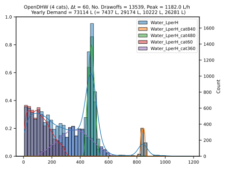
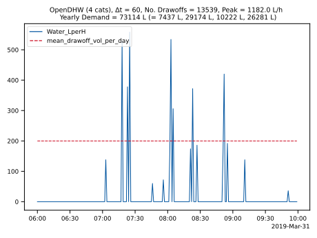

# OpenDHW Documentation

OpenDHW tries to mimic the behaviour of the popular free-to-use and public-funded Programme DHWcalc from Uni Kassel ([Link Paper](http://www.solar.uni-kassel.de/sat_publikationen_pdf/2005%20ISES-SWC%20Jordan%20und%20Vajen%20Program%20to%20Generate%20Domestic%20Hot%20Water%20Profiles%20with%20Statistical%20Means%20for%20User%20Defined%20Conditions.pdf), [Link Manual](https://www.uni-kassel.de/maschinenbau/fileadmin/datas/fb15/ITE/icons/Bilder_re2/Bilder_OpenSorp/dhw-calc_1-10_manual.pdf)), but implemented as a python script, rather than a standalone software.

## Core Structure

OpenDHW is mainly build on the Pandas Dataframe structure with the addition of using a DatetimeIndex ([Pandas Documentation Timeseries](https://pandas.pydata.org/pandas-docs/stable/user_guide/timeseries.html)). This ensure fast manipulation and easy plotting of the resulting timeseries. Thus, the base structure is always initialised by a dataframe and the chosen timestep width in seconds (s_step):

```Python
s_step = 60
date_range = pd.date_range(start='2019-01-01', end='2020-01-01', freq=str(s_step) + 'S')
date_range = date_range[:-1]
timeseries_df = pd.DataFrame(index=date_range, data={some data})
```

## DHWcalc

To better understand the workings of DHWcalc, some screenshots have been collected in [DHWcalc Screenshots](https://github.com/jonasgrs/OpenDHW/tree/main/Doc/DHWcalc_Screenshots).

## Generating Timeseries

The two main functions are the "generate_dhw_profile" function, which generates a DHW timeseries with the OpenDHW algorithm, and the "import_from_dhwcalc" function, which loads a timeseries previously generated by DHWcalc and saved in the [DHWcalc Files](https://github.com/jonasgrs/OpenDHW/tree/main/DHWcalc_Files) folder.


### Generate with OpenDHW

the generation with OpenDHW is comprised by 3 district steps:

1. The generation of a yearly probability profile
2. The generation of drawoff events
3. The placement of these drawoff events subject to the yearly probability profile

Similar to DHWcalc, there are two number of drawoffs categories: 1 and 4.

## Generation of a yearly probability profile

The generation of a yearly probability profile can is broken down into different functions in OpenDHW, following the DHWcalc paper:

1. The generation of daily probability list with step functions.
2. The shift between week and weekend day with a so-called "weekday-weekend-factor".
3. The generation of a yearly probabilities list with the help of an overlaied sine-function and a seasonal factor.
4. The normalisation of the final probabilities list based on its sum and then the final integration of that list.

The final probability profile looks is then added as the first column of the Dataframe.

### Daily probability list step functions

The daily probability profile looks like this for a weekday and a timestep of 60 seconds. The intervals are taken from DHWcalc.


### Yearly probabilities list

The yearly probability list looks like this for a timestep of 60 seconds and a sesonal factor of 0.1:


### Normalised and summed yearly probability profile

The normalised and summed probability profile looks like this for a timestep of 60 seconds and a seasonal factor of 0.1:


## Generation and Placement of Drawoff Events

### Generation

Drawoffs are generated until the set total Volume is reached:

```Python
V_curr = 0
V_max = 10000
drawoffs = []
    
while V_curr <= V_max:
    drawoff = generate_single_drawoff_inside_boundaries()
    drawoffs.append(drawoff)

    drawoff_L = drawoff / 3600 * s_step * drawoff_steps
    V_curr += drawoff_L
```

To ensure that that the drawoff happens inside the set boundaries, only drawoffs that meet the boundary criteria are appended:

```Python
def generate_single_drawoff_inside_boundaries(cats_series):

    mu = 100
    sig = 50
	
    drawoff = random.gauss(mu, sig)
	
    max_drawoff_flow_rate = 1200
    min_drawoff_flow_rate = 1
	
    low_lim = max(float(mu - 2 * sig), min_drawoff_flow_rate)
    up_lim = min(float(mu + 2 * sig), max_drawoff_flow_rate)
	
    while drawoff < low_lim or drawoff > up_lim:
        drawoff = random.gauss(mu, sig)
	
    return drawoff
```

The resulting drawoffs list might look something like this:

No Drawoff  | Flow Rate [L/h]
------------- | -------------
0  | 102
...  | ...
51  | 40
52  | 156
53  | 98
...  | ...
200  | 127


### Placement

For each drawoff event, a random value between 0 and 1 is generated.

```Python
	p_drawoffs = [random.uniform(0, 1) for _ in drawoffs]
```


No Drawoff  | probabilities drawoffs
------------- | -------------
0  | 0.56
...  | ...
51  | 0.03
52  | 0.57
53  | 0.09
...  | ...
200  | 0.37

Now we have two lists:

1. The yearly probability profile with values between 0 and 1
2. The drawoff probabilities, with values between 0 and 1


Now we have sort the index of the drawoff list into the probability list to get the timestamp, when that particular drawoff event happens within the year.

Timestep  | yearly probability list
------------- | -------------
0  | 0
...  | ...
5000  | 0.561
5001  | 0.562
5002  | 0.580
5003  | 0.582
...  | ...
8760  | 1


We could achieve this by looping over the yearly probability list for each drawoff event and placing it individually. This could be achieved by two nested for loops, looking something like this:

```Python
water_LperH = [0] * int(365 * 24 * 3600 / s_step)
drawoffs = [23, 56, 87, 123, 254, 23, 402, 335]
p_drawoffs = [0.41, 0.23, 0.31, 0.97, 0.13, 0.76, 0.04, 0.55]

for i, p_drawoff_event in enumerate(p_drawoffs):

	for timestep, p_timestep in enumerate(yearly_probabilities_lst):
		
		if p_timestep >= p_drawoff_event:
			
			water_LperH[timestep] = drawoffs[i]
			break
```

However, two nested for loops would increase the runtime quadratically O(n^2). Instead the drawoff probabilities list is sorted. Then, the yearly probability list is iterated over once. Every time a drawoff is placed in the yearly Flow Rates list, the next higher drawoff probability is be selected by means of a counter.

```Python
water_LperH = [0] * int(365 * 24 * 3600 / s_step)
drawoffs = [23, 56, 87, 123, 254, 23, 402, 335]
p_drawoffs = [0.04, 0.13, 0.23, 0.31, 0.41, 0.55, 0.76, 0.97]
drawoff_count = 0

for step, p_current_sum in enumerate(p_norm_integral):

    if p_drawoffs[drawoff_count] < p_current_sum:
        water_LperH[step] = drawoffs[drawoff_count]
        drawoff_count += 1

        if drawoff_count >= len(drawoffs):
            break
```

However, this algorithm doesn't allow for the possibility for two drawoffs to fall into the same timestep (a feature that is crucial to DHWcalc).
Thus, like in the algorithm before, everytime a drawoff is placed in the yearly Flow Rates list, the next higher drawoff probability should be selected by means of a counter. Then, if that next drawoff probabiliy falls into the same timestep, two drawoffs happen at the same timestep. If not, the iteration of the yearly probability list continues until the drawoff can be placed.

A possible workaround might be to split up the drawoff_probabilities_lst in smaller pieces, which are then distributed like the algorithm above. F.e. if the drawoff probabilities list is split into 3 pieces, 3 drawoffs could happen at the same timestep.
```Python
water_LperH = [0] * int(365 * 24 * 3600 / s_step)
drawoffs = [23, 56, 87, 123, 254, 23, 402, 335]
p_drawoffs = [0.04, 0.13, 0.23, 0.31, 0.41, 0.55, 0.76, 0.97]


pieces = 3
for i in range(pieces):
    p_drawoffs_i = p_drawoffs[i::3]
    p_drawoffs_lsts.append(p_drawoffs_i)
    
drawoff_count = 0

for p_drawoffs_sublst in p_drawoffs_lsts:

	drawoff_sub_count = 0

    for time_step, p_current_sum in enumerate(p_norm_integral):

        if p_drawoffs_lst[sub_drawoff_count] < p_current_sum:
            water_LperH[time_step] = drawoffs[drawoff_count]
            drawoff_sub_count += 1
            drawoff_count += 1

        if drawoff_sub_count >= len(p_drawoffs_sublst):
            break
        
        if drawoff_count >= len(drawoffs):
            break
```

However, this is not a very nice solution. Instead, a while loop is implemented instead of the if-clause inside the for-loop. This insures that all drawoffs that fall into the selected timestep are placed, until the while condition is not true anymore:

```
Python
drawoff_count = 0

for time_step, p_current_sum in enumerate(p_norm_integral):

    if drawoff_count >= len(drawoffs):
        break

    while p_drawoffs[drawoff_count] < p_current_sum:
        water_LperH[step] = drawoffs[drawoff_count]
        drawoff_count += 1

```

The full implementation of OpenDHW is more advanced and includes the ability to distribute flowrates that are longer than the timestep width, and the ability to keep the final superposition of multiple categories below a set maximum flow rate. The current method in OpenDHW can be found [here](https://github.com/jonasgrs/OpenDHW/blob/main/OpenDHW.py#L533).

## Plotting Timeseries

### DHWcalc

To analyse the resulting timeseries, the main plot is a histogram of the flow rates.
Here, some Histogramms for DHWcalc are given:

For a timestep of 1min with 1 category:


And with 4 categories:


For a timestep of 15mins with 1 category:


And with four categories:


### OpenDHW

For a timestep of 1min with 1 categories:


And with 4 categories:



The corresponding Lineplot:



## Comparing the Performance of OpenDHW to DHWcalc

The results of OpenDHW still already match the ones from DHWcalc quite well. One drawback is, that DHWcalc still consistently yields fewer no. of drawoffs per year. We can see this by comparing two timeseries by means of a subplot:

For a timestep of 1min:


and 15min:


and 60min:


Same goes for four categories, for a timestep of 1min:


and 15min:


and 60min:


## Open Todos:

Generally, the Todos to make OpenDHW truly comparable to DHWcalc are listed as #todo in the main script and the examples. Right now, probably the biggest tasks are:

- bringing the number of drawoffs further down to the DHWcalc level
- improving the placement algorithm, so that it no longer depends on slicing the probabilities of drawoffs. (for more explanation, see [this OpenDHW code](https://github.com/jonasgrs/OpenDHW/blob/main/OpenDHW.py#L533). Cant be that hard.
- researching daily probability profiles for non residential buildings
- implementing a fixed random seed option, so that the same inputs can always produce the same outputs if needed.
